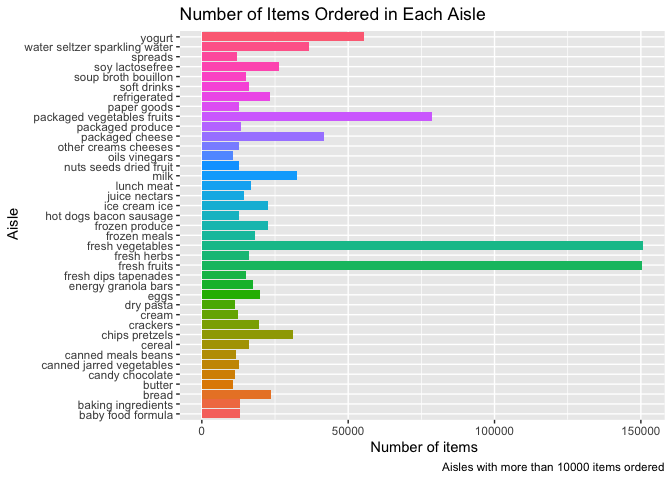
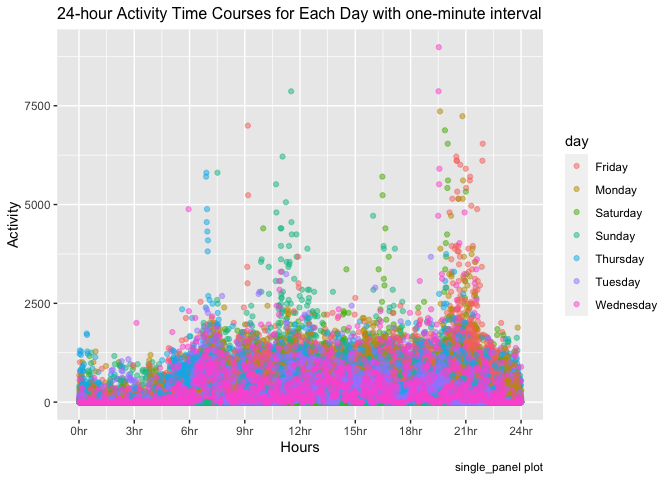

p8105_fx2184_hw3
================
Fei
2022-10-16

``` r
library(tidyverse)
```

    ## ── Attaching packages ─────────────────────────────────────── tidyverse 1.3.2 ──
    ## ✔ ggplot2 3.3.6     ✔ purrr   0.3.4
    ## ✔ tibble  3.1.7     ✔ dplyr   1.0.9
    ## ✔ tidyr   1.2.1     ✔ stringr 1.4.0
    ## ✔ readr   2.1.2     ✔ forcats 0.5.1
    ## ── Conflicts ────────────────────────────────────────── tidyverse_conflicts() ──
    ## ✖ dplyr::filter() masks stats::filter()
    ## ✖ dplyr::lag()    masks stats::lag()

``` r
library(readr)
library(devtools)
```

    ## Loading required package: usethis

# problem1

``` r
#import the dataset
library(p8105.datasets)
instacart_df = instacart  %>% 
        as_tibble(instacart)
# giving illstrative examples of first 10 observations
head(instacart_df, 10)
```

    ## # A tibble: 10 × 15
    ##    order_id product_id add_to_cart_order reordered user_id eval_set order_number
    ##       <int>      <int>             <int>     <int>   <int> <chr>           <int>
    ##  1        1      49302                 1         1  112108 train               4
    ##  2        1      11109                 2         1  112108 train               4
    ##  3        1      10246                 3         0  112108 train               4
    ##  4        1      49683                 4         0  112108 train               4
    ##  5        1      43633                 5         1  112108 train               4
    ##  6        1      13176                 6         0  112108 train               4
    ##  7        1      47209                 7         0  112108 train               4
    ##  8        1      22035                 8         1  112108 train               4
    ##  9       36      39612                 1         0   79431 train              23
    ## 10       36      19660                 2         1   79431 train              23
    ## # … with 8 more variables: order_dow <int>, order_hour_of_day <int>,
    ## #   days_since_prior_order <int>, product_name <chr>, aisle_id <int>,
    ## #   department_id <int>, aisle <chr>, department <chr>

-   the instacart dataset has 1384617 observations, and 15 variables,
    they are order_id, product_id, add_to_cart_order, reordered,
    user_id, eval_set, order_number, order_dow, order_hour_of_day,
    days_since_prior_order, product_name, aisle_id, department_id,
    aisle, department.
-   In total, there are 39123 products found in 131209 orders from
    131209 distinct users.

``` r
# How many aisles are there, and which aisles are the most items ordered from?
n_aisles= instacart_df %>%
  group_by(aisle_id,aisle) %>% 
  distinct() %>% 
  summarize(n_order = n()) %>% 
  arrange(desc(n_order)) %>% 
  ungroup()
```

    ## `summarise()` has grouped output by 'aisle_id'. You can override using the
    ## `.groups` argument.

``` r
# Make a plot that shows the number of items ordered in each aisle, limiting this to aisles with more than 10000 items ordered.
n_aisles %>%
  filter(n_order >10000) %>% 
  ggplot(aes(x =n_order, y=aisle, fill = aisle))+
  geom_bar(
    stat = "identity"
  )  +
  labs(
    title = 'Number of Items Ordered in Each Aisle',
    caption = 'Aisles with more than 10000 items ordered',
    x = ' Number of items',
    y = ' Aisle'
  ) + theme(legend.position = "topright") 
```

<!-- --> \* There
are 134 aisles are there, and the most ites ordered from
`fresh vegetables`. \* The plot shows the number of items ordered in
each aisle.

``` r
# Make a table showing the three most popular items in each of the aisles “baking ingredients”, “dog food care”, and “packaged vegetables fruits”. Include the number of times each item is ordered in your table.

instacart_df %>% 
  filter(aisle == c("dog food care", "packaged vegetables fruits","baking ingredients")) %>%              
  group_by(aisle, product_name) %>% 
  summarize(n_order = n()) %>% 
  arrange(desc(n_order)) %>% 
  do(head(.,n =3)) %>% 
  knitr::kable(
    caption = "Three Most Popular Items in each of the aisles")
```

    ## `summarise()` has grouped output by 'aisle'. You can override using the
    ## `.groups` argument.

| aisle                      | product_name                       | n_order |
|:---------------------------|:-----------------------------------|--------:|
| baking ingredients         | Light Brown Sugar                  |     169 |
| baking ingredients         | Pure Baking Soda                   |     122 |
| baking ingredients         | Premium Pure Cane Granulated Sugar |     118 |
| dog food care              | Good Buddy Beef Jerky Dog Treat    |      11 |
| dog food care              | Small Dog Biscuits                 |      11 |
| dog food care              | Original Beef Flavor Dog Snacks    |       9 |
| packaged vegetables fruits | Organic Baby Spinach               |    3219 |
| packaged vegetables fruits | Organic Raspberries                |    1882 |
| packaged vegetables fruits | Organic Blueberries                |    1634 |

Three Most Popular Items in each of the aisles

``` r
# Make a table showing the mean hour of the day at which Pink Lady Apples and Coffee Ice Cream are ordered on each day of the week; format this table for human readers (i.e. produce a 2 x 7 table).
instacart_df %>% 
  filter(product_name == c("Pink Lady Apples", "Coffee Ice Cream")) %>% 
  group_by(product_name,order_dow) %>% 
  summarize( mean_hour_of_day = mean(order_hour_of_day)) %>% 
  mutate(order_dow = recode(order_dow,
                            "0" = "Monday",
                            "1" = "Tuesday",
                            "2" = "Wednesday", 
                            "3" = "Thursday", 
                            "4" = "Friday", 
                            "5" = "Saturday", 
                            "6" = "Sunday"
  )) %>% 
  pivot_wider(
    names_from = order_dow,
    values_from = mean_hour_of_day) %>% 
  knitr::kable(
    digits = 2,
    caption = "Mean Hour of the Day")
```

    ## `summarise()` has grouped output by 'product_name'. You can override using the
    ## `.groups` argument.

| product_name     | Monday | Tuesday | Wednesday | Thursday | Friday | Saturday | Sunday |
|:-----------------|-------:|--------:|----------:|---------:|-------:|---------:|-------:|
| Coffee Ice Cream |  13.22 |   15.00 |     15.33 |    15.40 |  15.17 |    10.33 |  12.35 |
| Pink Lady Apples |  12.25 |   11.68 |     12.00 |    13.94 |  11.91 |    13.87 |  11.56 |

Mean Hour of the Day

# problem 2

Traditional analyses of accelerometer data focus on the total activity
over the day. Using your tidied dataset, aggregate across minutes to
create a total activity variable for each day, and create a table
showing these totals. Are any trends apparent? Accelerometer data allows
the inspection activity over the course of the day. Make a single-panel
plot that shows the 24-hour activity time courses for each day and use
color to indicate day of the week. Describe in words any patterns or
conclusions you can make based on this graph.

``` r
# tidy the dataset 
accel<- read_csv("accel_data.csv") %>% 
  janitor::clean_names() %>% 
  pivot_longer(
    activity_1:activity_1440, 
    names_to = "minute",
    values_to = "activity",
    names_prefix = "activity_", 
  ) %>% 
  mutate(
    day_of_week = recode(day,
                         "Monday" = "Weekday", 
                         "Tuesday" = "Weekday", 
                         "Wednesday" = "Weekday", 
                         "Thursday" = "Weekday", 
                         "Friday" = "Weekday", 
                         "Saturday" = "Weekend", 
                         "Sunday" = "Weekend"))
```

    ## Rows: 35 Columns: 1443
    ## ── Column specification ────────────────────────────────────────────────────────
    ## Delimiter: ","
    ## chr    (1): day
    ## dbl (1442): week, day_id, activity.1, activity.2, activity.3, activity.4, ac...
    ## 
    ## ℹ Use `spec()` to retrieve the full column specification for this data.
    ## ℹ Specify the column types or set `show_col_types = FALSE` to quiet this message.

-   The dataset `accel` contains 50400 observations, and 6 varibles,
    which are week, day_id, day, minute, activity, day_of_week.
-   Each observation represent a male subject’s activity count per
    minute of each day during five weeks.

\#aggregate across minutes

``` r
#aggregate across minutes to create a total activity variable for each day, and create a table showing these totals. Are any trends apparent?
accel %>% 
  group_by(week,day) %>% 
  summarize(total_activity=sum(activity)) %>% 
  spread(key= day, total_activity) %>% 
  select("Monday","Tuesday","Wednesday","Thursday","Friday","Saturday","Sunday") %>% 
  knitr::kable(digits = 0,
    catpion = "Aggregation of a Total Activity across Minutes for Each Day")
```

    ## `summarise()` has grouped output by 'week'. You can override using the
    ## `.groups` argument.
    ## Adding missing grouping variables: `week`

| week | Monday | Tuesday | Wednesday | Thursday | Friday | Saturday | Sunday |
|-----:|-------:|--------:|----------:|---------:|-------:|---------:|-------:|
|    1 |  78828 |  307094 |    340115 |   355924 | 480543 |   376254 | 631105 |
|    2 | 295431 |  423245 |    440962 |   474048 | 568839 |   607175 | 422018 |
|    3 | 685910 |  381507 |    468869 |   371230 | 467420 |   382928 | 467052 |
|    4 | 409450 |  319568 |    434460 |   340291 | 154049 |     1440 | 260617 |
|    5 | 389080 |  367824 |    445366 |   549658 | 620860 |     1440 | 138421 |

-   From the table, it hard to tell there is a trend exists. However, in
    the first 3 weeks, it seems like the subject has higher total
    activity during the weekend than weekdays.

``` r
#Accelerometer data allows the inspection activity over the course of the day. Make a single-panel plot that shows the 24-hour activity time courses for each day and use color to indicate day of the week. Describe in words any patterns or conclusions you can make based on this graph.
accel %>% 
  group_by(minute,day) %>% 
  mutate(minute =as.numeric(minute)) %>% 
  ggplot(aes(x = minute/60, y = activity)) + 
  geom_point(aes(color = day), alpha = .5) + 
   scale_x_continuous(
    breaks = c(0, 3, 6, 9, 12, 15, 18, 21, 24),
    labels = c("0hr", "3hr", "6hr", "9hr", "12hr", "15hr", "18hr", "21hr", "24hr")) + 
  labs(
    title = "24-hour Activity Time Courses for Each Day with one-minute interval",
    x = "Hours",
    y = "Activity",
    caption = "single_panel plot")+
  theme(plot.title = element_text(size=12))
```

<!-- -->

-   Between 0hr (12am) to 6hr (6am), it is to be observed that the
    activity count of a 63 year-old male is the lowest across days.
    Around 7hr (7am), his activity count is relatively high on some
    Thursdays. Around 9hr (9am), his activity count is quite high on
    some Fridays. Around 12hr (12pm), his activity count is high on many
    Sundays. Between 16hr (4pm) and 17hr (5pm), his activity count is
    relatively high on a decent number of weekends. Between 20hr (8pm)
    and 22hr(10pm), his activity count is high across many days,
    especially on Friday followed by Saturday, Wednesday, Monday.

# problem 3
